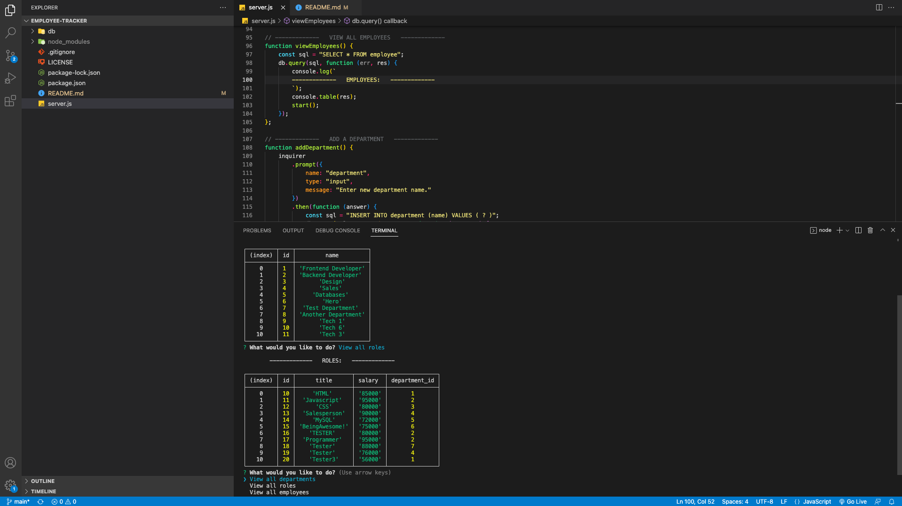

# Employee-Tracker
A command-line application from scratch to manage a company's employee database, using Node.js, Inquirer, and MySQL.

## Description
- In this challenge I created a note taking app that is used to write and save notes. This app uses Express.js on the back end and will save and retrieve note data from a JSON file.

- In this challenge I created a employee database using node.js, express.js, and MySQL.  This allows the user to using the command line to view current department, roles and employees.  The user can also add a department or role.  

The future of this project:
- I plan to complete the add an employee, update employee, and exit.

---

## Technologies
Node.js

Express.js

MySQL

---
## Website 

Click [here](https://drive.google.com/file/d/1bkjvzFH0QVlc_HupD_aXuXyshxQJXuvz/view) to go to my Employee-Tracker application video. 

## Credits
- Thank you to the UTA-Bootcamp team.
- The Coding Collective
- Private tutor Scott Everett
- Private tutor David Elutilo

## License

Distributed under the MIT License. Please see the LICENSE.txt for more information.

---
